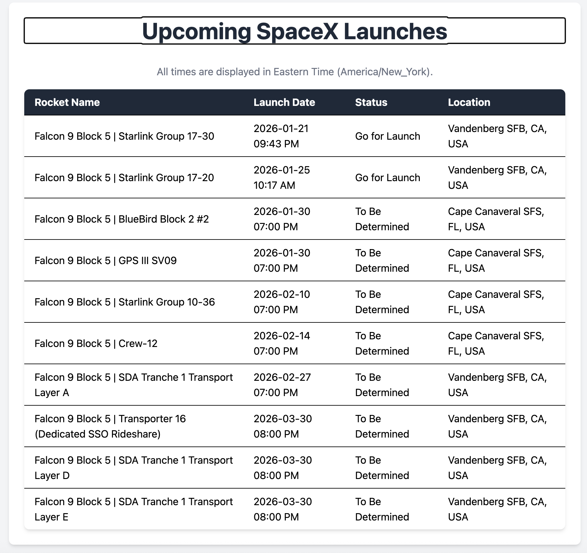

# SpaceX Upcoming Launches

SpaceX Upcoming Launches Blazor is a full-stack web application built with Blazor Server and ASP.NET Core. It provides real-time information about upcoming SpaceX launches using data sourced from the Launch Library 2 API.

The application features a clean, responsive UI and allows users to explore launch schedules, mission details, launch statuses, and locations.
## Features
- **Upcoming Launches**: Displays a detailed list of SpaceX's upcoming launches, including:  
  - Launch date and time  
  - Mission name  
  - Launch status  
  - Launch location  
- **Responsive Design**: A fully responsive UI optimized for desktop and mobile devices.

## Architecture Overview

This application is a full-stack Blazor Server app:

- Frontend
  - Razor components
  - TailwindCSS
  - Responsive layout
- Backend
  - ASP.NET Core
  - Server-side C# logic
  - API integration with Launch Library 2

Blazor Server enables seamless integration between frontend UI and backend logic within a single .NET application.

## Tech Stack

- .NET 9
- Blazor Server
- ASP.NET Core
- Razor Components
- TailwindCSS
- Launch Library 2 API

## Screenshot

## Getting Started

To get started with SpaceX Upcoming Launches Blazor, follow these steps:

1. **Clone the Repository**: `git clone https://github.com/your-username/SpaceX-Upcoming-Launches-Blazor.git`
2. **Navigate to the Directory**: `cd SpaceX-Upcoming-Launches-Blazor`
3. **Install Dependencies**: `dotnet restore --project SpaceXLaunchBlazorApp`
4. **Run the Application**: `dotnet run --project SpaceXLaunchBlazorApp`
5. **Open Your Browser**: Navigate to `https://localhost:5001` to view the application.

## Contributing

Contributions are welcome! To contribute to SpaceX's Upcoming Launches Blazor, follow these steps:

1. Fork the repository.
2. Create a new branch (`git checkout -b feature-name`).
3. Make your changes.
4. Commit your changes (`git commit -am 'Add new feature'`).
5. Push to the branch (`git push origin feature-name`).
6. Create a new Pull Request.
